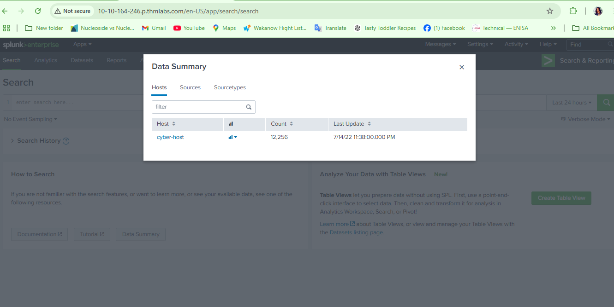

# Splunk SPL

### **Search Processing Language (SPL)** is used to make the search more effective. It comprises various functions and commands used together to form complex yet effective search queries to get optimized results.

Question1: What is the name of the host in the Data Summary tab?

### Question2: In the search History, what is the 7th search query in the list? (excluding your searches from today)

To Answer this, I clicked on the history bar, excluded the history containing 13mins ago

### Question 3: In the left field panel, which Source IP has recorded max events?

Answer:

To answer, i closed the history bar and  i navigated and clicked  the summary bar, next loaded up the data source. but there was no ip address field on the left panel so i scrolled al the way down and selected the more field where  i checked the ip field and closed the tap.

NExt, i went back in the i saw the populated ip address.

![{192]{90]{12]11 had the  highest count.](image%202.png)

{192]{90]{12]11 had the  highest count.

### Question 4: How many events are returned when we apply the time filter to display events on 04/15/2022 and Time from 08:05 AM to 08:06 AM?

Answer: 

To answer this , i navigated to the  all time menu and clicked on the drop down icon and selected the time and date range,clicked the apply button and it returned **134 events**

### Question 5: How many Events are returned when searching for Event ID 1  **AND** User as *James*?

Answer:

To answer this i had to use the search query in the search bar.

### Question 5: How many events are observed with Destination IP 172.18.39.6 AND destination Port 135?

Answer: 

I clicked on more field and checked the DestinationIP and DestinationPort section, Using the AND Function, It returned #4 events.

### Question 6: What is the Source IP with highest count returned with this Search query? Search Query: index=windowslogs  Hostname="Salena.Adam" DestinationIp="172.18.38.5"

Answer: Checked the Source IP session and found the answer>

### Question 7: In the index windowslogs, search for all the events that contain the term **cyber** how many events returned?

Answer: 

I used the | search command to look for Cyber but it returned 0

### Question 8: Now search for the term **cyber***, how many events are returned?

Answer

All i did was to add the wildcard * And it returned the number of event

                  

# Filtering the Results in SPL

### “Fields” this is used to add or remove fields using + - inbetween field names “**dedup” This is used to remove duplicate and only show unique value “Search” This is used to search for specific filed or strings                       “Rename” This is used to rename a field ‘rename src1p as outsourceIp**

### Question9: What is the third EventID returned against this search query?  `index=windowslogs | table _time EventID Hostname SourceName | reverse`

Notable, the reverse command is to pipe the data from the default  **Descending  splunk order to Ascending in regards to timeframe (timeline)**

### Question 10: Use the dedup command against the Hostname field before the reverse command in the query mentioned in Question 1. What is the first username returned in the Hostname field?

Answer:

So i added the | dedup Hostname and it returned the answer

### Question 11: Using the Reverse command with the search query index=windowslogs | table _time EventID Hostname SourceName - what is the HostName that comes on top?

### Question  12: What is the last EventID returned when the query in question 1 is updated with the **tail** command?

### Question 13: Sort the above query against the SourceName. What is the top SourceName returned?

# Transformational Splunk SPL

[Transformational Splunk spl](https://www.notion.so/Transformational-Splunk-spl-1b65f18a0bc98021882ce989be2d8111?pvs=21)

### Question 14: List the top 8 Image processes using the top command -  what is the total count of the 6th Image?

The number of of top 8 event is displayed.

### Question: 15: Using the rare command, identify the user with the least number of activities captured?

### Question 16:Create a pie-chart using the chart command - what is the count for the conhost.exe process?

I filtered for the Image  which contains process and that indicated the presence different Hosts e.g conHost

Conclusion:

i have learnt how to query  logs and Visualize data  for proper presentation. which is very important in log analysis.  Next i will be setting up alerts in splunk.
